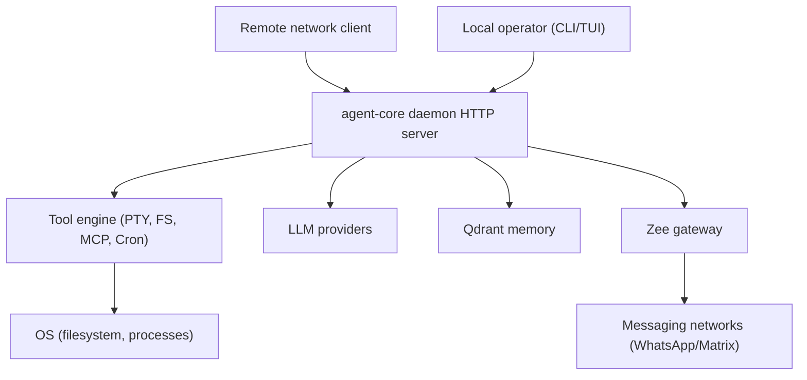

# agent-core Threat Model (2026-02-06)

This document is a repo-grounded threat model for `agent-core` (daemon + CLI/TUI) plus the Zee gateway integration, written against branch `dev` at commit `c5b4cfb2c489ae4b211a1cf4b12c61c867c6ec97`.

## Assumption Validation Check-In (Answer When Convenient)

Key assumptions (these materially affect risk ranking):
- The `agent-core` daemon is sometimes run with a non-loopback bind (for example via `--mdns` which defaults hostname to `0.0.0.0`). See `packages/agent-core/src/cli/network.ts:10-14` and `packages/agent-core/src/cli/network.ts:80-85`.
- Attacker model: a remote attacker on the same LAN/VPN can reach the daemon port when it is non-loopback, but has no shell access on the host.
- Single-user host: no multi-tenant hardening is expected, but accidental exposure should be treated as realistic.
- Zee gateway runs on the same machine as `agent-core` and is reached via loopback WebSocket by default. See `packages/agent-core/src/server/route/gateway.ts:63-70`.

Context questions:
1. Do you run `agent-core` with `--mdns` or `server.hostname=0.0.0.0` on networks you do not fully trust?
2. Are WhatsApp/Matrix inbound messages treated as untrusted user input (for example, can unknown contacts message the bot)?
3. Is this ever deployed on a shared host (for example, a multi-user Linux box) rather than a personal workstation?

## Executive summary

The highest-risk theme is that the daemon can be network-exposed while HTTP authentication is disabled by default, which enables direct access to privileged endpoints including PTY process spawning, MCP tool execution, credential management, and cron job scheduling. The next tier of risk comes from request-scoped directory selection and permission model defaults that can unintentionally bypass safeguards (for example, choosing `/` as the instance directory makes external-directory checks ineffective, and messaging surfaces default to a mode that auto-approves permissions). Availability risks mainly center on long-lived streaming endpoints and unbounded per-directory instance caching.

## Scope and assumptions

In-scope paths:
- `packages/agent-core/` (daemon, CLI/TUI, server routes, tools, permissions)
- `src/` (unified memory layer, Qdrant client)
- `packages/personas/zee/` (gateway auth and WS handling, tool invoke surface)

Out of scope:
- UI apps and website/documentation packages except where they affect runtime security posture.
- Third-party MCP servers or plugins beyond `agent-core` configuration and invocation paths.

Open questions that could change risk ranking:
- Whether daemon binds non-loopback in practice and whether it is reachable from untrusted networks.
- Whether inbound messaging users are trusted/allowlisted.
- Whether the daemon runs as a privileged OS user (root) or in a constrained container/VM.

## System model

### Primary components

- `agent-core` daemon HTTP server (Bun + Hono). Evidence: `Bun.serve(...)` via `Server.listen` in `packages/agent-core/src/server/server.ts:308-346`; routes mounted in `packages/agent-core/src/server/server.ts:183-208`.
- Authentication and (currently unused) scoped authorization helpers. Evidence: flags and auth config in `packages/agent-core/src/flag/flag.ts:44-48` and `packages/agent-core/src/server/auth.ts:105-199`; middleware only checks basic auth via `isAuthorized` in `packages/agent-core/src/server/server.ts:153-164`.
- Instance context and project boundary enforcement. Evidence: directory selection in `packages/agent-core/src/server/server.ts:165-181`; instance cache and boundary checks in `packages/agent-core/src/project/instance.ts:15-62`; external directory permission gate in `packages/agent-core/src/tool/external-directory.ts:12-31`.
- Privileged tool surfaces (selected examples). Evidence: PTY process creation in `packages/agent-core/src/server/route/pty.ts:31-54` and `packages/agent-core/src/pty/index.ts:97-161`; MCP management in `packages/agent-core/src/server/route/mcp.ts:30-93`; provider credential set/remove in `packages/agent-core/src/server/route/auth.ts:8-105`; cron job scheduling and execution in `packages/agent-core/src/server/route/cron.ts:28-158` and `packages/agent-core/src/cron/service/timer.ts:225-274`; TUI event publish in `packages/agent-core/src/server/route/tui.ts:239-276` and `packages/agent-core/src/cli/cmd/tui/event.ts:5-48`.
- Unified memory layer (Qdrant REST client). Evidence: outbound `fetch(...)` without explicit timeouts in `src/memory/qdrant.ts:78-106`.
- Zee gateway integration. Evidence: `agent-core` connects via WebSocket and reads auth token from env or `ZEE_GATEWAY_TOKEN_FILE` (default: `~/.local/state/agent-core/zee_gateway_token`) via `packages/agent-core/src/gateway/token.ts` and `packages/agent-core/src/server/route/gateway.ts`; gateway auth verification in `packages/personas/zee/src/gateway/auth.ts:207-259`; gateway WS handshake enforcement in `packages/personas/zee/src/gateway/server/ws-connection/message-handler.ts:560-615`.

### Data flows and trust boundaries

Operator terminal (local) -> daemon HTTP API:
- Channel: HTTP over loopback by default (`hostname` defaults to `127.0.0.1`). Evidence: `packages/agent-core/src/cli/network.ts:10-14`.
- Data: prompts, session messages, tool invocations, configuration.
- Security guarantees: depends on bind address; auth can be disabled by default. Evidence: `packages/agent-core/src/server/auth.ts:105-108`, `packages/agent-core/src/server/server.ts:158-164`.

Remote network client -> daemon HTTP API (when non-loopback):
- Channel: HTTP on `0.0.0.0` when enabled via config/flags. Evidence: `packages/agent-core/src/cli/network.ts:80-85` and `packages/agent-core/src/server/server.ts:308-325`.
- Data: full API surface including PTY, MCP, auth, cron.
- Security guarantees: optional Basic Auth only; no rate limiting; CORS is not a protection for non-browser clients. Evidence: `packages/agent-core/src/server/server.ts:138-164`.

Daemon -> OS filesystem and processes:
- Channel: local syscalls / subprocess spawn.
- Data: file reads/writes; arbitrary command execution via PTY spawn when exposed.
- Security guarantees: permission system is UX-oriented and can auto-allow in release mode. Evidence: `packages/agent-core/src/permission/next.ts:136-141` and hold mode resolution in `packages/agent-core/src/session/prompt.ts:146-158`.

Daemon -> Memory backend (Qdrant):
- Channel: HTTP `fetch` to Qdrant REST API.
- Data: embeddings, memory payloads, queries.
- Security guarantees: API-key header supported but network timeouts are not enforced in client. Evidence: `src/memory/qdrant.ts:78-106`.

Daemon -> Zee gateway:
- Channel: WebSocket to `ws://127.0.0.1:<port>` by default. Evidence: `packages/agent-core/src/server/route/gateway.ts:63-70`.
- Data: messaging send requests (WhatsApp/Matrix) and gateway control.
- Security guarantees: Zee gateway enforces token/password and can optionally verify Tailscale identity. Evidence: `packages/personas/zee/src/gateway/auth.ts:207-259`, `packages/personas/zee/src/gateway/server/ws-connection/message-handler.ts:560-615`.
- Risk note: `agent-core` can read a gateway token from disk via `ZEE_GATEWAY_TOKEN_FILE` (default: `~/.local/state/agent-core/zee_gateway_token`). The token file reader rejects symlinks, non-owned files, and unsafe permissions. Evidence: `packages/agent-core/src/gateway/token.ts`.

Daemon -> LLM providers and external HTTP resources:
- Channel: outbound HTTP; specific provider implementations are in-scope only as call sites and credential handling.
- Security guarantees: depends on provider config and secrets storage (not fully enumerated here).

#### Diagram

## Assets and security objectives

| Asset | Why it matters | Security objective (C/I/A) |
| --- | --- | --- |
| Host command execution capability | Direct RCE equals full compromise of the operator account | C, I, A |
| Filesystem contents (home dir, SSH keys, tokens) | Secret exfiltration and persistent access | C |
| Provider credentials (LLM, messaging, cloud) | Account takeover, billing abuse, data exfil | C, I |
| Session logs and prompts | May contain proprietary code and sensitive data | C |
| Cron job definitions and execution lane | Enables scheduled privileged actions | I, A |
| Memory store contents (Qdrant) | Can contain summarized sensitive info; integrity affects agent behavior | C, I |
| Gateway auth material (token/password) | Protects remote control plane for messaging and tools | C |
| Daemon availability (TUI/automation uptime) | Loss impacts developer workflow and automation tasks | A |

## Attacker model

### Capabilities

- Remote attacker can send arbitrary HTTP requests to the daemon if it is bound to a non-loopback address.
- Remote attacker can open many concurrent connections, including SSE streams.
- Remote attacker can send arbitrary request payloads (JSON) to endpoints that accept JSON bodies.
- If inbound messaging is enabled and not allowlisted, an attacker can send messages to the gateway and trigger agent turns.

### Non-capabilities

- No assumed local filesystem access without first obtaining code execution or a path traversal style bypass.
- No assumed ability to intercept loopback traffic without local presence.
- No assumed TLS termination or reverse proxy protections unless explicitly deployed (not evidenced in repo).

## Entry points and attack surfaces

| Surface | How reached | Trust boundary | Notes | Evidence (repo path / symbol) |
| --- | --- | --- | --- | --- |
| Daemon HTTP server listen | CLI `serve`, daemon, always-on, TUI worker | Remote network when non-loopback | `idleTimeout: 0`, route mounting, websockets | `packages/agent-core/src/server/server.ts:308-346` |
| Auth middleware | All routes except OPTIONS | Remote network | Auth can be disabled by default | `packages/agent-core/src/server/server.ts:153-164`, `packages/agent-core/src/server/auth.ts:105-108` |
| Scoped authorization helper (unused) | N/A | N/A | Present but not enforced in middleware | `packages/agent-core/src/server/auth.ts:176-199` |
| Directory selection per request | Query param or legacy header | Remote network | Affects project boundary decisions | `packages/agent-core/src/server/server.ts:165-180` |
| PTY create/update/connect | `POST /pty` + websockets | Remote network | Spawns processes; accepts command+args | `packages/agent-core/src/pty/index.ts:97-120` |
| MCP server management and tool call | `POST /mcp`, `POST /mcp/:name/tool` | Remote network | Can execute tools via MCP servers | `packages/agent-core/src/server/route/mcp.ts:30-93` |
| Provider credential set/remove | `PUT/DELETE /auth/:providerID` | Remote network | Can change credential material at runtime | `packages/agent-core/src/server/route/auth.ts:8-105` |
| Cron job create/run/wake | `POST /cron/jobs`, `/cron/jobs/:id/run` | Remote network | Includes `toolInvoke` path | `packages/agent-core/src/server/route/cron.ts:90-143` |
| Cron `toolInvoke` execution | Internal cron runner | Daemon -> tool engine | Cannot request permissions at runtime | `packages/agent-core/src/cron/service/timer.ts:225-274` |
| TUI event publish | `POST /tui/publish` | Remote network | Can trigger TUI actions and visibility changes | `packages/agent-core/src/server/route/tui.ts:239-276` |
| Global SSE stream | `GET /global/event` | Remote network | Long-lived stream, keepalive timers | `packages/agent-core/src/server/route/global.ts:147-207` |
| Zee gateway WS connect | `agent-core` -> gateway | Local loopback | Auth enforced by gateway | `packages/personas/zee/src/gateway/server/ws-connection/message-handler.ts:560-615` |
| Gateway token from `/tmp` | Local file read | Local host boundary | Secret-in-tmp risk | `packages/agent-core/src/server/route/gateway.ts:123-133` |
| Qdrant REST client | Outbound fetch | Daemon -> network service | No explicit request timeouts | `src/memory/qdrant.ts:78-106` |

## Top abuse paths

1. Goal: remote code execution on the host user
   1. Discover daemon is bound to non-loopback (for example via mDNS / config).
   2. Send `POST /pty` with attacker-chosen `command` and `args`.
   3. Connect to the PTY session and run arbitrary commands.
   4. Exfiltrate secrets from filesystem and persist.

2. Goal: data exfiltration outside the intended workspace boundary
   1. Send requests with directory selection set to `/`.
   2. Invoke file tools that rely on `Instance.containsPath` for external directory checks.
   3. Read files under `/home`, `/etc`, and other sensitive locations without triggering `external_directory` prompts.

3. Goal: silent privileged tool execution via messaging
   1. Send an inbound WhatsApp/Matrix message that triggers an agent turn.
   2. Session surface defaults resolve to release mode.
   3. Permission requests auto-allow in release mode, enabling tool execution without prompts.

4. Goal: persistently scheduled privileged actions
   1. Create a cron job with `payload.kind="toolInvoke"` and chosen tool/args.
   2. Trigger the job via `run` or via schedule.
   3. Cron runner executes tool, but cannot request permissions, removing an important guardrail.

5. Goal: availability degradation
   1. Open many SSE connections to `/global/event` and related streams.
   2. Each stream sets keepalive timers and pushes events.
   3. CPU/memory usage grows, impacting daemon responsiveness.

6. Goal: credential manipulation and downstream abuse
   1. Call provider auth endpoints to set/remove credentials.
   2. Redirect provider usage to attacker-controlled accounts, or break availability.

## Threat model table

| Threat ID | Threat source | Prerequisites | Threat action | Impact | Impacted assets | Existing controls (evidence) | Gaps | Recommended mitigations | Detection ideas | Likelihood | Impact severity | Priority |
| --- | --- | --- | --- | --- | --- | --- | --- | --- | --- | --- | --- | --- |
| TM-001 | Remote network attacker | Daemon bound to non-loopback and auth not effectively enabled | Invoke privileged HTTP routes (for example PTY creation) | Host compromise (RCE) | OS command exec, filesystem, credentials | Default bind is loopback (`packages/agent-core/src/cli/network.ts:10-14`) | Auth disabled by default (`packages/agent-core/src/server/auth.ts:105-108`); no additional gate on dangerous routes | Refuse non-loopback bind unless auth is enabled and configured; require password; add route-level scope enforcement | Log remote addr + route; alert on PTY/MCP/Cron/Auth route access from non-loopback | High (given assumption) | High | critical |
| TM-002 | Remote network attacker | Access to HTTP API, any valid credentials | Use admin routes beyond intended privilege | Integrity compromise | provider creds, config, cron, sessions | Scope model exists in code (`packages/agent-core/src/server/auth.ts:13-58`) | Middleware does not enforce scopes (`packages/agent-core/src/server/server.ts:153-164`) | Replace `isAuthorized` check with `authorizeRequestScoped` and map routes to scopes; add tests | Audit log denied vs allowed with required/granted scope | Medium | High | high |
| TM-003 | Remote network attacker | Ability to send requests and set instance directory | Bypass external directory protection via directory selection and path containment checks | Secret exfiltration | filesystem, secrets | External directory gate exists (`packages/agent-core/src/tool/external-directory.ts:12-31`) | Directory is request-controlled (`packages/agent-core/src/server/server.ts:165-180`); path containment is lexical (`packages/agent-core/src/project/instance.ts:56-62`) | Remove per-request directory override or gate behind admin scope + allowlist; use realpath-resolved containment for boundary checks | Log directory overrides and deny suspicious targets like `/` | High (given assumption) | High | critical |
| TM-004 | Remote messaging attacker | Messaging surface enabled; attacker can message | Trigger agent turns where permissions auto-allow | Integrity compromise and data exfil | OS/filesystem, credentials | Hold mode exists (`packages/agent-core/src/session/prompt.ts:146-158`) | Messaging defaults to release (`packages/agent-core/src/session/prompt.ts:155-157`); release auto-allows (`packages/agent-core/src/permission/next.ts:136-141`) | Default messaging to hold; require explicit allowlist to run dangerous tools; never auto-allow high risk permissions on messaging surfaces | Alert on tool usage originating from messaging surfaces | Medium (depends on allowlist) | High | high |
| TM-005 | Remote network attacker | Access to cron endpoints | Schedule `toolInvoke` that bypasses permission prompts | Integrity compromise | OS/filesystem, cron lane | Cron input schema validation exists (`packages/agent-core/src/server/route/cron.ts:28-71`) | Cron toolInvoke forbids permission requests (`packages/agent-core/src/cron/service/timer.ts:256-260`) | Restrict `toolInvoke` to safe allowlist; enforce permission evaluation at schedule-time; require admin scope for cron management | Log cron job creation and executions with tool name | Medium | High | high |
| TM-006 | Remote network attacker | Access to auth and MCP endpoints | Set provider credentials or add MCP servers; invoke tools | Account takeover / exfil / availability | provider creds, MCP integrations | Provider auth validates then removes on error (`packages/agent-core/src/server/route/auth.ts:64-71`) | If auth disabled, endpoints are effectively public | Require admin scope; add allowlists for provider IDs and MCP server names in server mode | Alert on provider credential changes | Medium | High | high |
| TM-007 | Remote network attacker | Network reachability | Open many streaming connections | DoS / degraded UX | daemon availability | Stream abort cleanup exists (`packages/agent-core/src/server/route/global.ts:201-205`) | No connection limits; `idleTimeout: 0` (`packages/agent-core/src/server/server.ts:311-315`) | Add per-IP connection caps; enforce auth; set sane `idleTimeout`; consider disabling SSE on non-loopback | Metrics on open connections, stream errors, event loop lag | High | Medium | high |
| TM-008 | Supply chain attacker / opportunistic exploit | Vulnerable dependency versions in runtime path | Exploit known CVEs in dependencies | Varies by CVE | daemon integrity/availability | Lockfile and audit are available | Audit indicates multiple high/moderate issues (see `security_best_practices_report.md`) | Upgrade dependencies; add CI audit gate; pin where needed | Monitor audit delta over time | Medium | Medium to High | medium |
| TM-009 | Local attacker on same host | Local read access to the operator state/config directories | Read or tamper with Zee gateway auth material | Gateway auth compromise | gateway auth token/password | Token file path defaults to `~/.local/state/agent-core/zee_gateway_token` and rejects symlinks, non-owned files, and unsafe permissions (`packages/agent-core/src/gateway/token.ts`) | If an attacker can read the operator home directory, they can likely access other secrets too | Prefer env/config tokens; keep state dir private (0700); consider OS keyring for higher assurance | Log when a file token is used (without content) | Low | Medium | low |

## Criticality calibration

Definitions for this repo and assumed environment:
- critical: remote attacker can execute OS commands or gain equivalent access to the operator account without a strong auth barrier.
Examples: TM-001 (PTY spawn via unauthenticated network daemon); TM-003 (directory boundary bypass leading to secret exfil in common setups).
- high: attacker can reach privileged actions with partial controls (for example, authenticated but overly broad privileges), or can cause sustained DoS.
Examples: TM-005 (cron toolInvoke with missing permission gate); TM-007 (SSE connection exhaustion).
- medium: exploitation requires uncommon preconditions or yields limited impact.
Examples: TM-009 on hosts where untrusted local users exist; selected dependency vulnerabilities that require specific request patterns.
- low: informational issues or low-impact misconfigurations.

## Focus paths for security review

| Path | Why it matters | Related Threat IDs |
| --- | --- | --- |
| `packages/agent-core/src/server/server.ts` | Route mounting, auth middleware, instance directory selection, server listen config | TM-001, TM-002, TM-003, TM-007 |
| `packages/agent-core/src/server/auth.ts` | Auth default and scope model | TM-001, TM-002 |
| `packages/agent-core/src/flag/flag.ts` | Auth enable/disable flags and defaults | TM-001 |
| `packages/agent-core/src/pty/index.ts` | Process spawning surface | TM-001 |
| `packages/agent-core/src/server/route/cron.ts` | Cron API routes | TM-005 |
| `packages/agent-core/src/cron/service/timer.ts` | Cron execution, toolInvoke permission behavior | TM-005 |
| `packages/agent-core/src/server/route/auth.ts` | Provider credential manipulation surface | TM-006 |
| `packages/agent-core/src/server/route/mcp.ts` | MCP management and tool invocation | TM-006 |
| `packages/agent-core/src/server/route/tui.ts` | Event publish surface | TM-007 (and secondary effects) |
| `packages/agent-core/src/project/instance.ts` | Project boundary logic and caching | TM-003, TM-007 |
| `packages/agent-core/src/tool/external-directory.ts` | External directory permission gate | TM-003 |
| `packages/agent-core/src/session/prompt.ts` | Hold mode defaulting by surface | TM-004 |
| `packages/agent-core/src/permission/next.ts` | Release mode auto-allow | TM-004 |
| `packages/agent-core/src/server/route/gateway.ts` | Gateway token loading and per-call WS connect | TM-009 |
| `src/memory/qdrant.ts` | Outbound memory store access and timeout behavior | TM-007 (reliability), TM-008 |
| `packages/personas/zee/src/gateway/auth.ts` | Gateway auth enforcement controls | TM-006, TM-009 |
| `packages/personas/zee/src/gateway/server/ws-connection/message-handler.ts` | WS handshake and auth enforcement | TM-006, TM-009 |

## Quality check

- Entry points discovered are represented in the "Entry points and attack surfaces" table.
- Each trust boundary appears in at least one threat.
- Runtime behavior is separated from tests and docs; dependency vulnerabilities are handled as supply chain threats.
- Assumptions are explicit at top, with questions to confirm.
